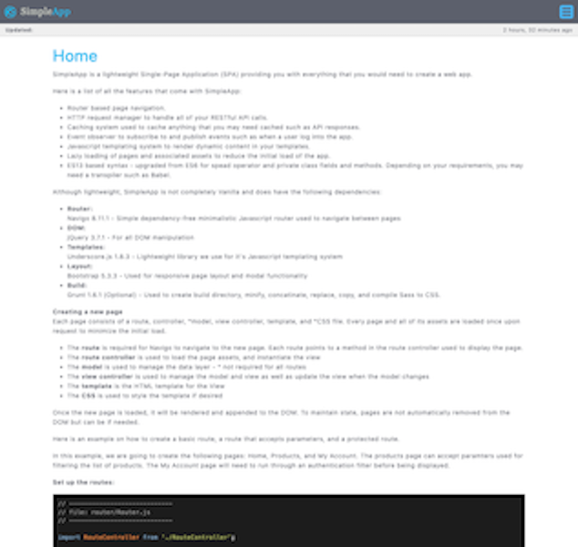
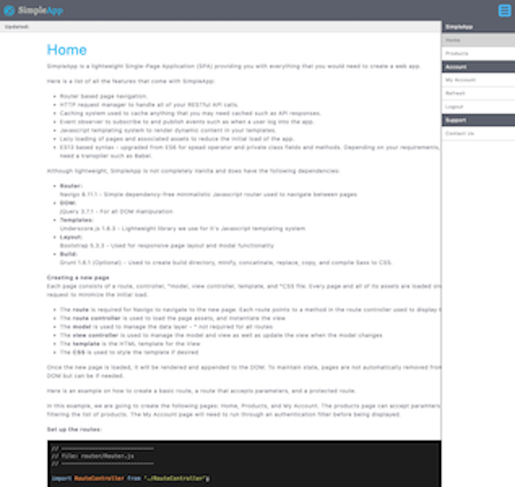
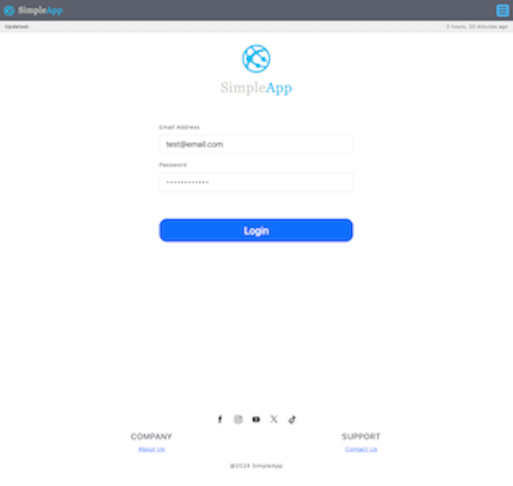
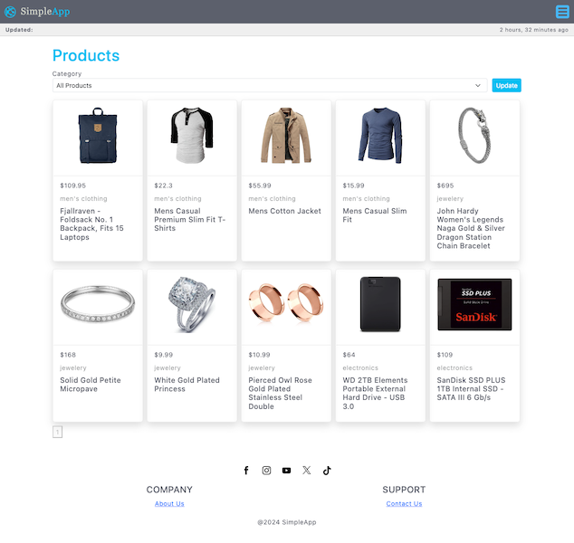
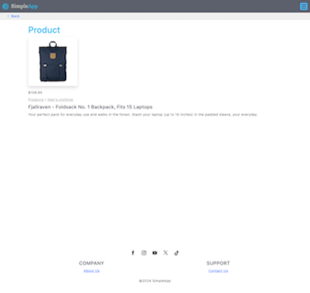
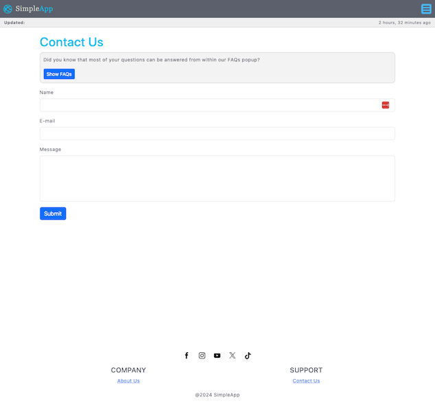
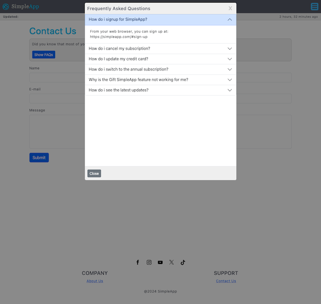
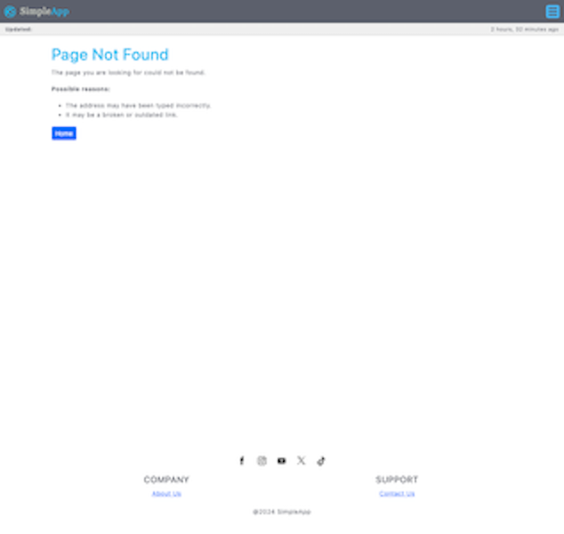

# SimpleApp SPA Template
This is a single-page application starter template with example pages to get you started.

## Prerequisites
- [**npm**](https://www.npmjs.com/) to install all the necessary packages
- [**Grunt**](https://gruntjs.com) to build the application

## Installing
First clone the project and install dependencies:
```bash
mkdir single_page_application && cd single_page_application
git clone https://github.com/kappytown/single_page_application.git
npm install
```

## Building
```bash
npm run dev
```

## Features
- Router based page navigation.
- HTTP request manager to handle all of your RESTful API calls.
- Caching system used to cache anything that you may need cached such as API responses.
- Event observer to subscribe to and publish events such as when a user log into the app.
- Javascript templating system to render dynamic content in your templates.
- Lazy loading of pages and associated assets to reduce the initial load of the app.
- ES13 based syntax - upgraded from ES6 for spead operator and private class fields and methods. Depending on your requirements, you may need a transpiler such as Babel.

## Dependencies
Although lightweight, SimpleApp is not completely Vanilla and does have the following dependencies:

- **Router**:
Navigo 8.11.1 - Simple dependency-free minimalistic Javascript router used to navigate between pages
- **DOM**:
jQuery 3.7.1 - For all DOM manipulation
- **Templates**:
Underscore.js 1.8.3 - Lightweight library we use for it's Javascript templating system
- **Layout**:
Bootstrap 5.3.3 - Used for responsive page layout and modal functionality
- **Build**:
Grunt 1.6.1 (Optional) - Used to create build directory, minify, concatinate, replace, copy, and compile Sass to CSS.

## Layout design
       

Main layout structure:
```pug
// Wrapper
div.wrapper
  // Header
  header.header
    ...

  // Main
  main
    // Section (Page Content)
    section#content
      ...

  // Footer
  footer.footer
    ...
```

## Cache busting
The application version number `v=v1.00.00` is automatically appended to each asset file name upon build.

## Authors
- [**@kappytown**](https://github.com/kappytown) - Entire project from concept to completion